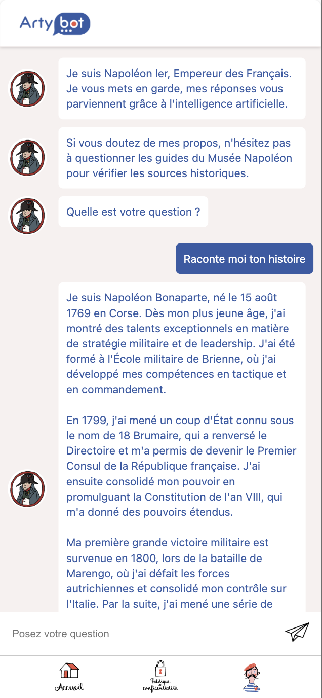

# ArtyStory

  

ArtyStory est un Chatbot conversationnel qui permet de dialoguer avec une figure emblématique de l'Histoire. L’utilisateur peut poser toutes les questions de son choix. Cela est possible grâce à la puissance de ChatGPT.

## Configuration :
- Vue.js
- Vite.js (Attention avec Vite car il y a des choses qui changent par rapport à Vue-CLI)
- API de ChatGPT

## Installation :
* Cloner le répo disponible à cette adresse : https://github.com/killian-dv/ArtyStory
* Ouvrir un terminal et lancer la commande :
`npm install`
* Pour lancer le projet en local, lancer la commande :
`npm run dev`
* La clé d’API se situe dans un fichier .env à la racine du projet.  Elle sera à rajouter dans le projet.
`VITE_OPENAI_API_KEY = "votre-clé-d'API-OPEN-AI"`

## Structure :

 * La plupart du code du chatbot se situe dans un composant appelé Chatbot.vue `(src/components/Chatbot.vue)`. Le code est commenté pour expliquer les différentes fonctionnalités. Le CSS est aussi dans ce composant.
 * Les images sont à déposer dans le dossier `(src/assets/)`
 * Chaque personnage est généré grâce à une View situé dans le dossier `(src/views/)`. On passe en paramètre les infos suivantes pour le composant. 
   - Message d’accueil
   - Le prompt à donner à ChatGPT
   - Le nom de la photo de profil du Chatbot
 * Les routes se trouvent dans `(src/router/index.js)`

## Déploiement :

**Déploiement automatique**
Cette méthode utilise une GitHub Action pour compiler et déployer les fichiers de la branche main sur le serveur. Pour cela, il suffit juste de faire un push sur la branche `main`.

    git add .
    git commit -m "Ajout de ...."
    git push

Remplacer “Ajout de ...” par la modification effectuée

## Chatbots disponibles :

* https://histo.artybot.fr/napoleon
* https://histo.artybot.fr/marie-antoinette
* https://histo.artybot.fr/ronsard
* https://histo.artybot.fr/alexandre-dumas
* https://histo.artybot.fr/chateaubriand
* https://histo.artybot.fr/jules-cesar
* https://histo.artybot.fr/pere-noel
* https://histo.artybot.fr/rosa-bonheur
* https://histo.artybot.fr/victor-hugo
* https://histo.artybot.fr/renoir
* https://histo.artybot.fr/la-fontaine
* https://histo.artybot.fr/claude-monnet
* https://histo.artybot.fr/hector-berlioz
* https://histo.artybot.fr/erik-satie
* https://histo.artybot.fr/stendhal
* https://histo.artybot.fr/balzac
* https://histo.artybot.fr/denis-diderot
* https://histo.artybot.fr/emile-coue
* https://histo.artybot.fr/george-sand
* https://histo.artybot.fr/maurice-leblanc
* https://histo.artybot.fr/voltaire
* https://histo.artybot.fr/arthur-rimbaud
* https://histo.artybot.fr/auguste-bartholdi
* https://histo.artybot.fr/auguste-escoffier
* https://histo.artybot.fr/auguste-rodin
* https://histo.artybot.fr/champollion
* https://histo.artybot.fr/edmond-rostand
* https://histo.artybot.fr/emile-zola
* https://histo.artybot.fr/francois-rabelais
* https://histo.artybot.fr/gustave-caillebotte
* https://histo.artybot.fr/gustave-flaubert
* https://histo.artybot.fr/jean-jacques-rousseau
* https://histo.artybot.fr/jeanne-darc
* https://histo.artybot.fr/jules-verne
* https://histo.artybot.fr/marcel-proust
* https://histo.artybot.fr/michel-de-montaigne
* https://histo.artybot.fr/nostradamus
* https://histo.artybot.fr/paul-cezanne
* https://histo.artybot.fr/paul-verlaine
* https://histo.artybot.fr/pierre-corneille
* https://histo.artybot.fr/sarah-bernhardt
* https://histo.artybot.fr/camille-claudel